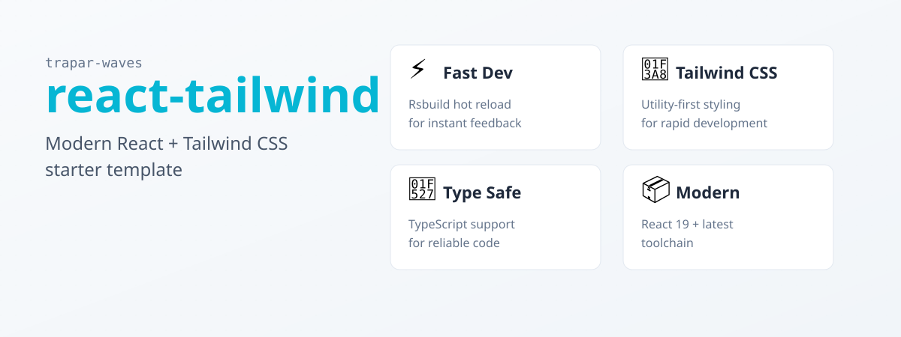

# @trapar-waves/react-tailwind




---

[English](../README.md) | [中文](./README-CN.md) | [Русский язык](./README-RU.md)

> React と Tailwind CSS を統合したモダンな UI 開発テンプレート。Rsbuild、TypeScript、ESLint（Antfu 設定）、Iconify サポート付き。


- **モダン UI フレームワーク：** React (v19) を使用したコンポーネント駆動の宣言的インターフェース。
- **ユーティリティファーストのスタイリング：** Tailwind CSS v4（`tailwindcss`）と `@tailwindcss/postcss` を採用し、柔軟で迅速なスタイリングを実現しながら一貫性を維持。
- **高速開発ワークフロー：** Rsbuild（`@rsbuild/core` と `@rsbuild/plugin-react`）を使用し、最適化されたビルドと効率的な開発サーバー性能を実現。
- **アイコンサポート：** `@iconify/json` と `@iconify/tailwind4` を含み、スケーラブルでカスタマイズ可能なアイコンを提供。
- **型安全性：** TypeScript (v5.9.x) を活用し、コードの信頼性を向上させ、開発中に堅牢な型チェックを提供。
- **コード品質：** ESLint と `@antfu/eslint-config` を含み、リントとベストプラクティスの適用を強制。
- **Git Hooks：** `husky` と `lint-staged` を統合し、コミット前チェックを実行。


- **フレームワーク/ライブラリ：** React (v19)
- **スタイリング：** Tailwind CSS (`tailwindcss`)
- **ビルドツール：** Rsbuild (`@rsbuild/core`)
- **言語：** TypeScript (v5.9.x)
- **CSS 処理：** PostCSS と `@tailwindcss/postcss`
- **リント：** ESLint と `@antfu/eslint-config`
- **アイコン：** Iconify (`@iconify/json`, `@iconify/tailwind4`)

依存関係の完全なリストは [package.json](../package.json) を参照してください。


### 前提条件

- Node.js（>= 18.x 推奨）
- パッケージマネージャー（npm、yarn、または pnpm）

### インストール

1. テンプレートを使用して新しいプロジェクトを作成：

   ```bash
   pnpm create trapar-waves
   ```

2. プロジェクトディレクトリに移動し、依存関係をインストール：

   ```bash
   pnpm install
   ```

3. 開発サーバーを起動：

   ```bash
   pnpm dev
   ```


```
├── public/           # 静的アセット
├── src/              # ソースコード
│   ├── App.css       # グローバルスタイルと Tailwind インポート
│   ├── App.tsx       # メインアプリケーションコンポーネント
│   └── index.tsx     # エントリーポイント
├── rsbuild.config.ts # Rsbuild 設定
├── tsconfig.json     # TypeScript 設定
├── eslint.config.js  # ESLint 設定
└── package.json      # プロジェクトの依存関係とスクリプト
```


コントリビュートを歓迎します！以下の手順に従ってコントリビュートしてください：

1. リポジトリをフォーク
2. 機能ブランチを作成（`git checkout -b feature/amazing-feature`）
3. 変更をコミット（`git commit -m 'Add some amazing feature'`）
4. ブランチにプッシュ（`git push origin feature/amazing-feature`）
5. Pull Request を作成


MIT License © 2025 Trapar Waves

## 👤 作者

- **Rikka：** [admin@rikka.cc](mailto:admin@rikka.cc)
- **GitHub プロフィール：** [Muromi-Rikka](https://github.com/Muromi-Rikka)

## 🔗 リンク

- **リポジトリ：** [https://github.com/Trapar-waves/react-tailwind](https://github.com/Trapar-waves/react-tailwind)
- **Issues：** [https://github.com/Trapar-waves/react-tailwind/issues](https://github.com/Trapar-waves/react-tailwind/issues)
